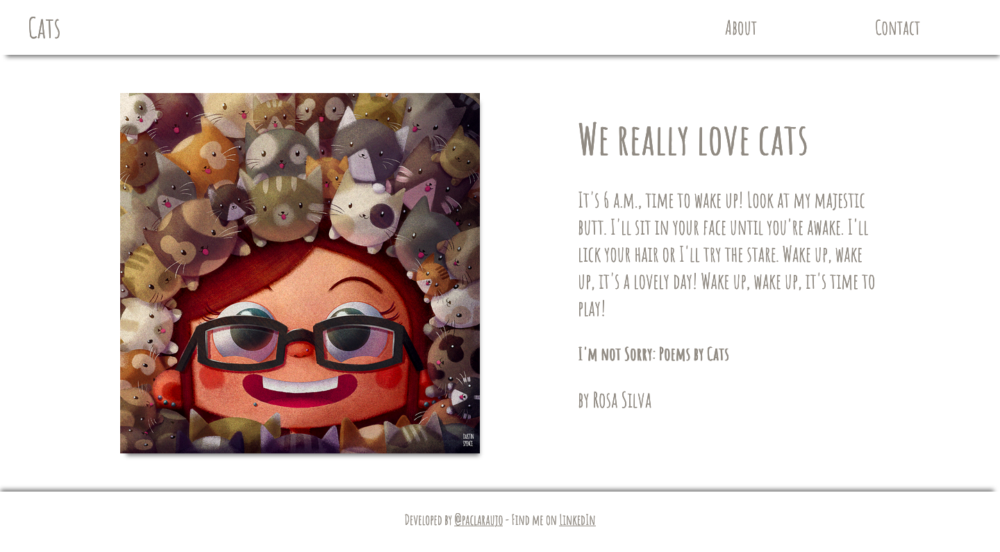

# Cats Single-Page Application

A simple SPA using JavaScript.

<p align="center">
  
</p>

## Getting Started

### Installing

To install the dependencies in your project's directory run:

```
npm install
```

## Starting the app

```
npm start
```

Runs the app in the development mode.

## Built With

* HTML5
* CSS3
* JS - ES6

## Authors

* **Paloma Araujo** - [@paclaraujo](https://github.com/paclaraujo)

## Acknowledgments

* Image by [Dustin Spence](https://www.behance.net/dustinspence) - [Behance](https://www.behance.net/gallery/45557521/The-Cat-Invasion)
* Texts - [I'm not Sorry: Poems by Cats](https://www.amazon.com/Im-Not-Sorry-Poems-Cats/dp/1985123126) by Rosa Silva and [Patch](https://patch.com/georgia/snellville/7-reasons-why-we-love-cats).